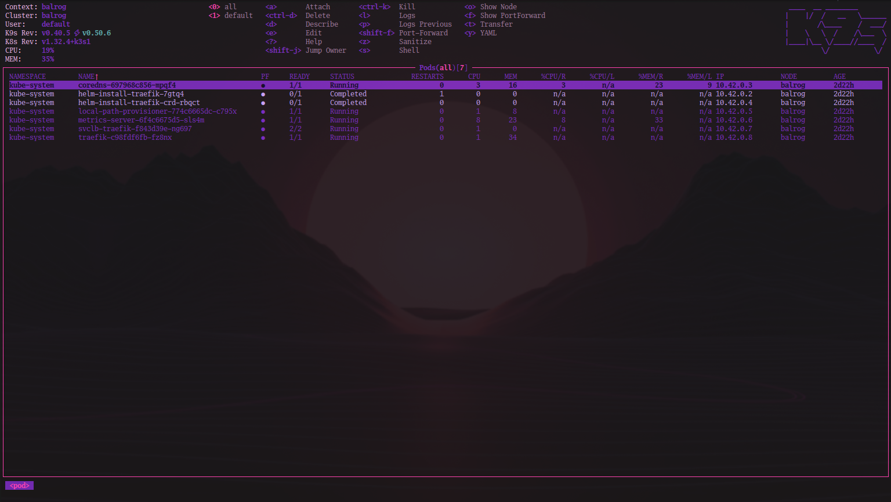
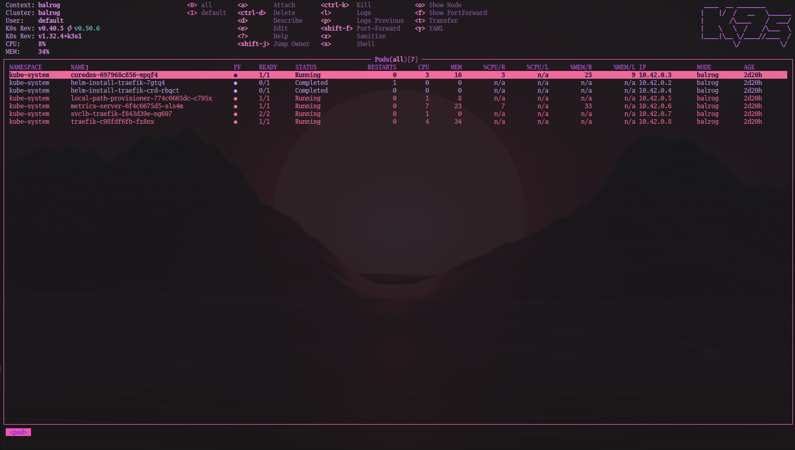

# Techno Haze skin for K9s



<details>
  <summary>☀️ Day</summary>
  
</details>

## Install

Clone this repo and copy `skins/techno-haze.yaml` to `~/.config/k9s/skins/`.

You can do it without cloning as well:

```bash
curl https://raw.githubusercontent.com/cacarico/techno-haze-k9s/refs/heads/main/skin/tehcnho-haze.yaml -o ~/.config/k9s/skins/techno-haze.yaml
```

Then add it to you k9s config `~/.config/k9s/config.yaml`

```yaml
k9s:
  ui:
    skin: techno-haze-night
    #skin: techno-haze-day
```
